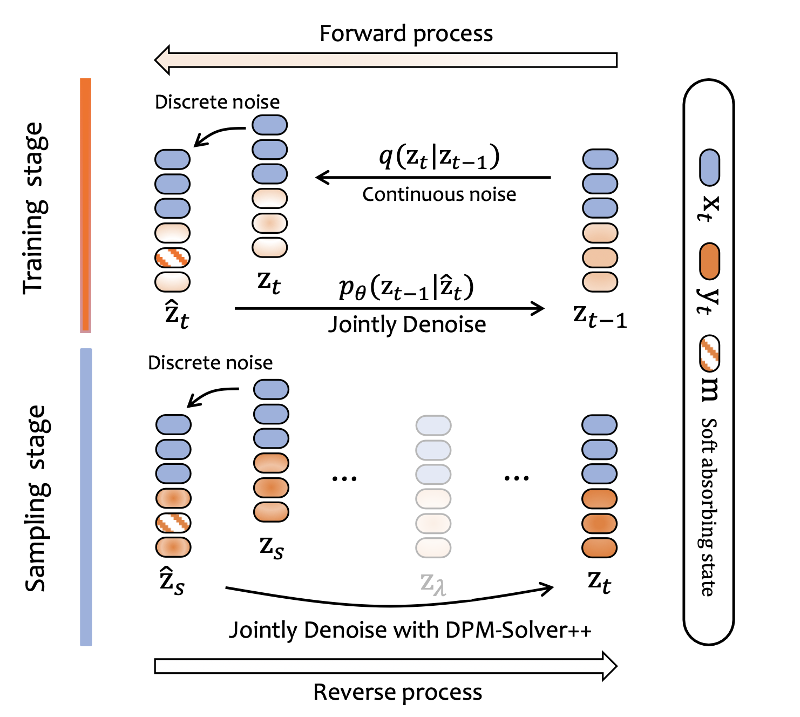
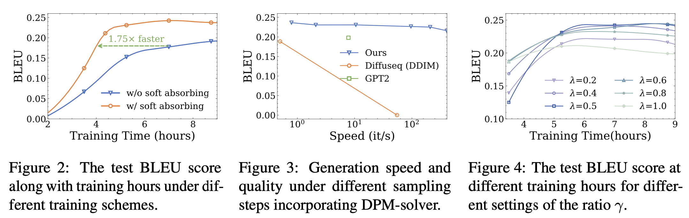

#  DiffuSeq

Official Codebase for [*__*DiffuSeq*__: Sequence to Sequence Text Generation With Diffusion Models*](https://arxiv.org/abs/2210.08933) and 
[*__*DiffuSeq-v2*__: Bridging Discrete and Continuous Text Spaces for Accelerated Seq2Seq Diffusion Models*](https://arxiv.org/abs/2310.05793).

<p align = "center">

</p>
<p align = "center">
The diffusion process of our conditional diffusion language model DiffuSeq.
</p>

<p align = "center">

</p>
<p align = "center">
The diffusion process of accelerated DiffuSeq.
</p>

## Highlights
- We add soft learned absorbing state. By using absorbing states, we can remove the clamp operation. In other words, we can consider the absorbing state as a landmark in the embedding space.
- We add discrete noise, which can further bridge the gap between the continous and discrete text space. 
- We use DPM-solver++ to speed up sampling.
 
Our enhanced version effectively accelerates the training convergence by 4x and generates samples of similar quality 800x faster, rendering it significantly closer to practical application.

<p align = "center">

</p>

## Setup:
The code is based on PyTorch and HuggingFace `transformers`.
```bash 
pip install -r requirements.txt 
```

## DiffuSeq Training
```bash
cd scripts
bash train.sh
```
Arguments explanation:
- ```--dataset```: the name of datasets, just for notation
- ```--data_dir```: the path to the saved datasets folder, containing ```train.jsonl,test.jsonl,valid.jsonl```
- ```--seq_len```: the max length of sequence $z$ ($x\oplus y$)
- ```--resume_checkpoint```: if not none, restore this checkpoint and continue training
- ```--vocab```: the tokenizer is initialized using bert or load your own preprocessed vocab dictionary (e.g. using BPE)

It will take 2 more days to train a __*DiffuSeq*__ model on 4 NVIDIA A100 80G GPUs for QG and QQP, and the training steps should be increased accordingly along with the size of the training set. To reproduce the results of Table 1 in our paper, we suggest the following configuration for each dataset when training.

### Update: Additional argument

- ```--learned_mean_embed```: set whether to use the learned soft absorbing state.
- ```--denoise```: set whether to add discrete noise
- ```--use_fp16```: set whether to use mixed precision training
- ```--denoise_rate```: set the denoise rate, with 0.5 as the default

It only take around 11 hours to train a model on 2 NVIDIA A100 80G GPUs for QQP.

## Speed-up Decoding
We customize the implementation of [DPM-Solver++](https://github.com/LuChengTHU/dpm-solver) to DiffuSeq to accelerate its sampling speed.
```bash
cd scripts
bash run_decode_solver.sh
```

## Citation
Please add the citation if our paper or code helps you.

```
@inproceedings{gong2022diffuseq,
  author = {Gong, Shansan and Li, Mukai and Feng, Jiangtao and Wu, Zhiyong and Kong, Lingpeng},
  booktitle = {International Conference on Learning Representations, ICLR},
  title = {{DiffuSeq}: Sequence to Sequence Text Generation with Diffusion Models},
  year = 2023
}

@article{gong2023diffuseqv2,
  title={DiffuSeq-v2: Bridging Discrete and Continuous Text Spaces for Accelerated Seq2Seq Diffusion Models},
  author={Gong, Shansan and Li, Mukai and Feng, Jiangtao and Wu, Zhiyong and Kong, Lingpeng},
  journal={arXiv preprint arXiv:2310.05793},
  year={2023}
}
```